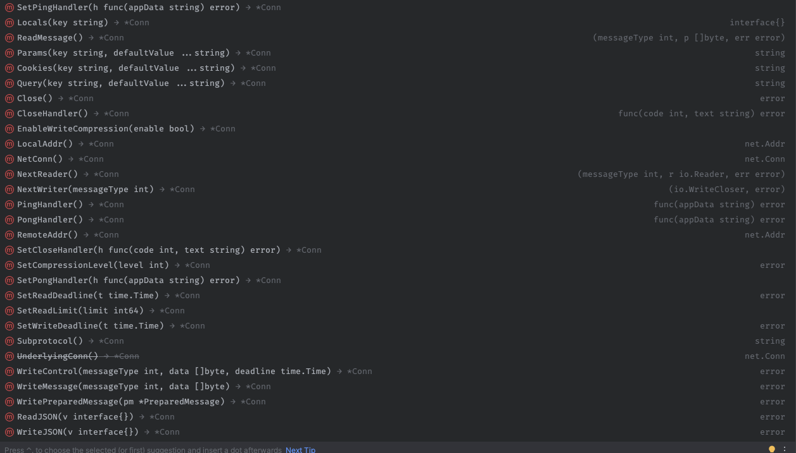

# WebSocket wrapper for [Fiber v2](https://github.com/gofiber/fiber) with events support
[](https://goreportcard.com/report/github.com/antoniodipinto/ikisocket)
[](https://godoc.org/github.com/antoniodipinto/ikisocket)
[](https://github.com/antoniodipinto/ikisocket/blob/master/LICENSE)
### Based on [Fiber Websocket](https://github.com/gofiber/websocket) and inspired by [Socket.io](https://github.com/socketio/socket.io)

### Upgrade to Fiber v2 details [here](https://github.com/antoniodipinto/ikisocket/issues/6) 


## Any bug?
Create ad issue following [this](https://github.com/antoniodipinto/ikisocket/blob/master/.github/ISSUE_TEMPLATE/bug_report.md) template


## Feature request?
Create ad issue following [this](https://github.com/antoniodipinto/ikisocket/blob/master/.github/ISSUE_TEMPLATE/feature_request.md) template


## ⚙️ Installation

```
go get -u github.com/antoniodipinto/ikisocket
```

## 📖 ️ [Documentation](https://pkg.go.dev/github.com/antoniodipinto/ikisocket#section-documentation)

```go
// Initialize new ikisocket in the callback this will
// execute a callback that expects kws *Websocket Object
func New(callback func(kws *Websocket)) func(*fiber.Ctx) error
```
---
```go
// Add listener callback for an event into the listeners list
func On(event string, callback func(payload *EventPayload))
```

ikisocket public/global functions (many thanks to [Daniel Morawetz](https://github.com/dmorawetz))

```go
// Emit the message to a specific socket uuids list
// Ignores all errors
func EmitToList(uuids []string, message []byte)
```
---

```go
// Emit to a specific socket connection
func EmitTo(uuid string, message []byte) error
```
---

```go
// Broadcast to all the active connections
// except avoid broadcasting the message to itself
func Broadcast(message []byte)
```
---
```go
// Fire custom event on all connections
func Fire(event string, data []byte) 
```

Supported events:

```go
// Supported event list
const (
	// Fired when a Text/Binary message is received
	EventMessage = "message"
	// More details here:
	// @url https://developer.mozilla.org/en-US/docs/Web/API/WebSockets_API/Writing_WebSocket_servers#Pings_and_Pongs_The_Heartbeat_of_WebSockets
	EventPing = "ping"
	EventPong = "pong"
	// Fired on disconnection
	// The error provided in disconnection event
	// is defined in RFC 6455, section 11.7.
	// @url https://github.com/gofiber/websocket/blob/cd4720c435de415b864d975a9ca23a47eaf081ef/websocket.go#L192
	EventDisconnect = "disconnect"
	// Fired on first connection
	EventConnect = "connect"
	// Fired when the connection is actively closed from the server
	EventClose = "close"
	// Fired when some error appears useful also for debugging websockets
	EventError = "error"
)
```
Event Payload object
```go
// Event Payload is the object that
// stores all the information about the event and
// the connection
type EventPayload struct {
	// The connection object
	Kws *Websocket
	// The name of the event
	Name string
	// Unique connection UUID
	SocketUUID string
	// Optional websocket attributes
	SocketAttributes map[string]string
	// Optional error when are fired events like
	// - Disconnect
	// - Error
	Error error
	// Data is used on Message and on Error event
	Data []byte
}
```
---

### FastHTTP Websocket connection exposed [Request #30](https://github.com/antoniodipinto/ikisocket/issues/30)
```go
type Websocket struct {
    // The FastHTTP connection
    Conn *websocket.Conn
}
```
Can be accessed from 
```go 
kws.Conn
```
This will allow direct access to the following FastHTTP functions




---

Socket instance functions

```go
// Set a specific attribute for the specific socket connection
func (kws *Websocket) SetAttribute(key string, attribute string)
```
---

```go
// Get socket connection UUID
func (kws *Websocket) GetUUID() string
```
---

```go
// Set socket connection UUID
func (kws *Websocket) SetUUID(uuid string)
```
---

```go
// Get a specific attribute from the socket attributes
func (kws *Websocket) GetAttribute(key string) string
```
---


```go
// Emit the message to a specific socket uuids list
func (kws *Websocket) EmitToList(uuids []string, message []byte) 
```
---

```go
// Emit to a specific socket connection
func (kws *Websocket) EmitTo(uuid string, message []byte) error
```
---


```go
// Broadcast to all the active connections
// except avoid broadcasting the message to itself
func (kws *Websocket) Broadcast(message []byte, except bool)
```
---

```go
// Fire custom event
func (kws *Websocket) Fire(event string, data []byte)
```
---

```go
// Emit/Write the message into the given connection
func (kws *Websocket) Emit(message []byte)
```
---


```go
// Actively close the connection from the server
func (kws *Websocket) Close() 
```
---

## ⚡️ [Examples](https://github.com/antoniodipinto/ikisocket/tree/master/examples)


